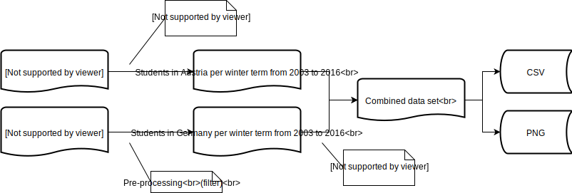

# 188.475 - Digital Preservation - SS18 - Lab 1.1

- Georg Hagmann, 01226641
- Alexander Rashed, 01325897

#### Description

This script combines different datasets to create a comparison of the total number of students in Germany and Austria from the winter semester 2003 to 2016.

#### Execute

Install the necessary requirements:

```
pip3 install -r requirements.txt
```

Execute the script:

```
./analyze.py
```

Possible parameters / configuration:

```
usage: analyze.py [-h] [-v] [-p]

optional arguments:
  -h, --help     show this help message and exit
  -v, --verbose  Sets the log level to DEBUG
  -p, --plot     Open a windows showing the plot (not supported when executed in docker)
```

#### Docker

Build the image:
```
docker build --tag dpue .
```
Execute the script (and mount the folder where you want to store the results at `/usr/src/app/output`):
```
docker run --rm -v $PWD/output:/usr/src/app/output dpue -v
```

#### Data sources:
- [Federal Ministry of Education and Research Germany](http://www.datenportal.bmbf.de)
  - Data-set: [Total number of students and German students, by types of higher education institution](http://www.datenportal.bmbf.de/portal/2.5.23) 
  - License: [dl-de/by-2-0](http://www.govdata.de/dl-de/by-2-0)
  - Remarks: This script uses a subset of this data-set and transforms it.
- [Statistik Austria](data.statistik.gv.at)
  - Data-set: [Studierende an öffentlichen Universitäten -insgesamt](https://www.data.gv.at/katalog/dataset/66453c59-ae4b-37b6-80d4-25dfeeab1376)
  - License: [CC-BY-3.0](https://creativecommons.org/licenses/by/3.0/)

#### Data processing:

1. Download the Austrian data-set from Statistik Austria

2. Preprocessing of the Austrian dataset

   - Combine the actual dataset with the header definitions
   - Remove unused columns (only keep the students per term)
   - Rename the index  to 'WS<yy>'
   - Group the entries by the term and sum up the amounts of students (in order to get the total amount of students over all types of Universities)

3. Download the German data-set from the Federal Ministry of Education and Research

4. Preprocessing of the German dataset

   - Remove all unused rows and columns (only keep the data for all students - including non-German citizens - from 2003 to 2016)
   - Rename the index to 'WS<yy>'

5. Combine the two datasets

6. Persist the data as CSV

7. Plot the data (and persist it as PNG)

8. Optionally show the plot in a separate window

   

#### License of this work: [CC BY 3.0](https://creativecommons.org/licenses/by/3.0/)